# 💼 Job Application Tracker


A modern and responsive **Job Application Tracker** built with **React**, **PHP**, **MySQL**, and **Tailwind CSS**. The system enables job seekers to organize applications, monitor application progress, manage company wishlists, keep interview notes, and visualize job search statistics through an interactive dashboard.

The project follows a clean **dark minimalist dashboard** design and demonstrates full-stack development using a REST API, responsive UI, and database-driven CRUD operations.

---

## ✨ Features

- 📊 Interactive Dashboard
- 💼 Job Application Management
- ➕ Add, Edit & Delete Applications
- ❤️ Wishlist Management
- 📝 Notes Management
- 📈 Analytics Dashboard
- 📊 Charts & Application Statistics
- 🔍 Search, Filter & Sorting
- 📱 Responsive Design
- 🌙 Dark Minimalist UI
- 🔗 REST API Integration
- 🗄️ MySQL Database

---

## 🛠️ Built With

| Technology | Purpose |
|------------|---------|
| React.js | Frontend Framework |
| Vite | Build Tool |
| Tailwind CSS | UI Styling |
| React Router | Client-side Routing |
| Lucide React | Icons |
| Recharts | Analytics Charts |
| PHP | REST API Backend |
| MySQL | Database |
| XAMPP | Local Development Environment |

---

# 📸 Application Preview

## Dashboard

### Dashboard Overview

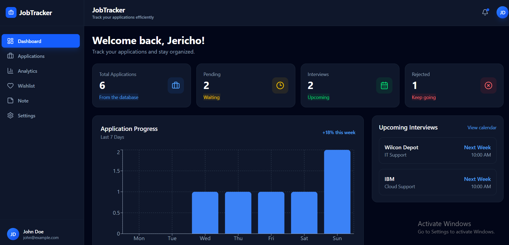

### Dashboard Statistics

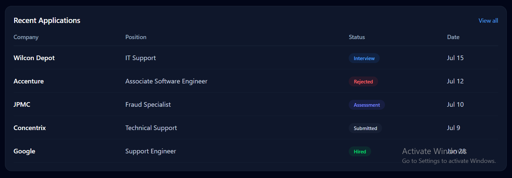

---

## Applications

### Application Management

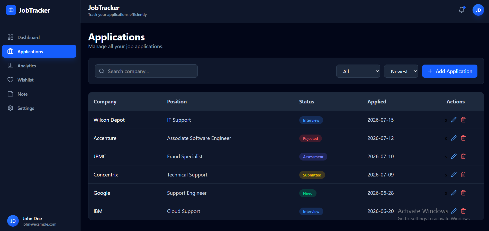

### Add Application

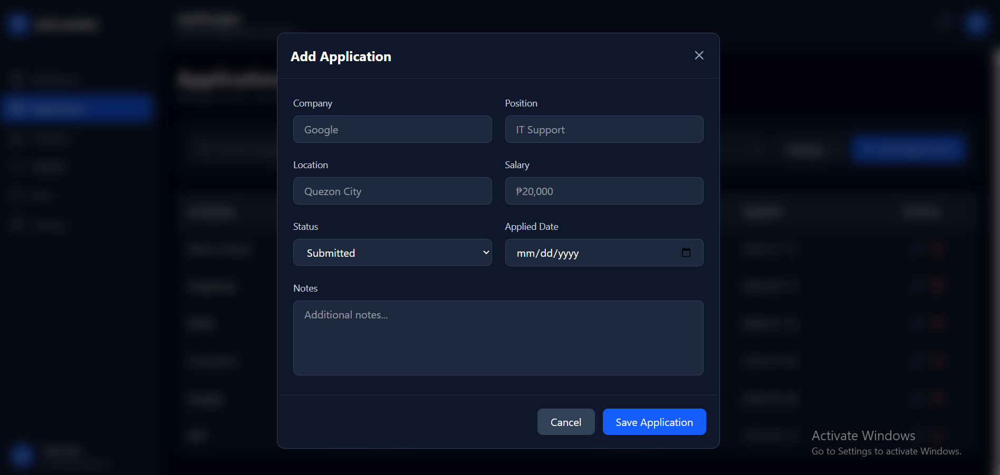

---

## Wishlist

### Wishlist Page

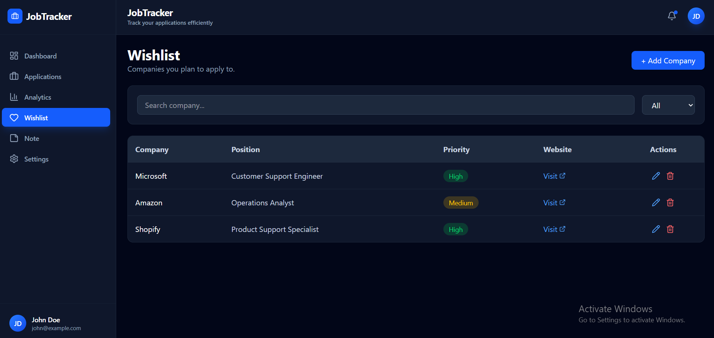

### Add Wishlist

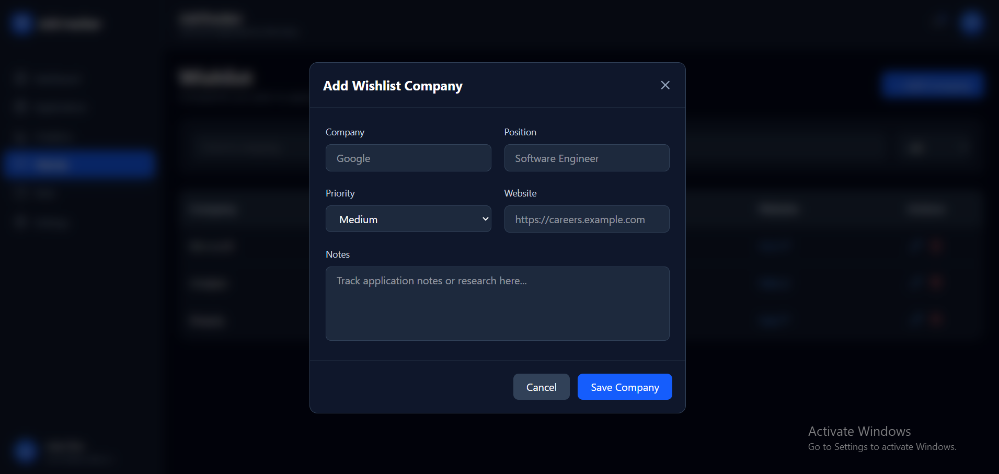

---

## Notes

### Notes Page

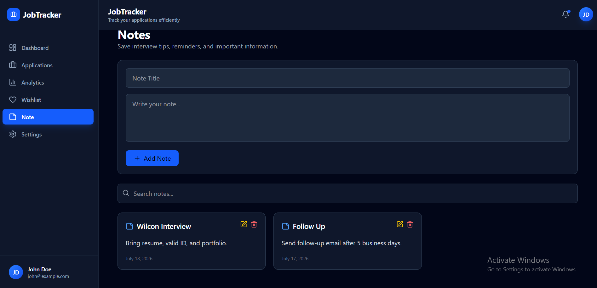

---

## Analytics

### Analytics Dashboard

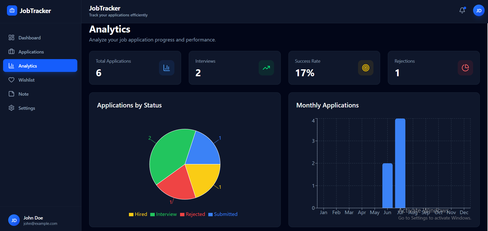

### Charts & Reports

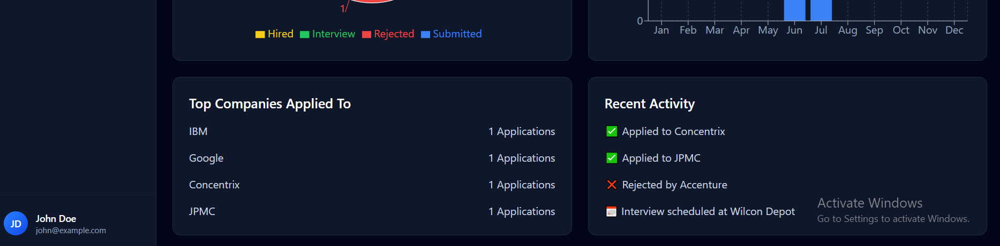

---

## Settings

### General Settings

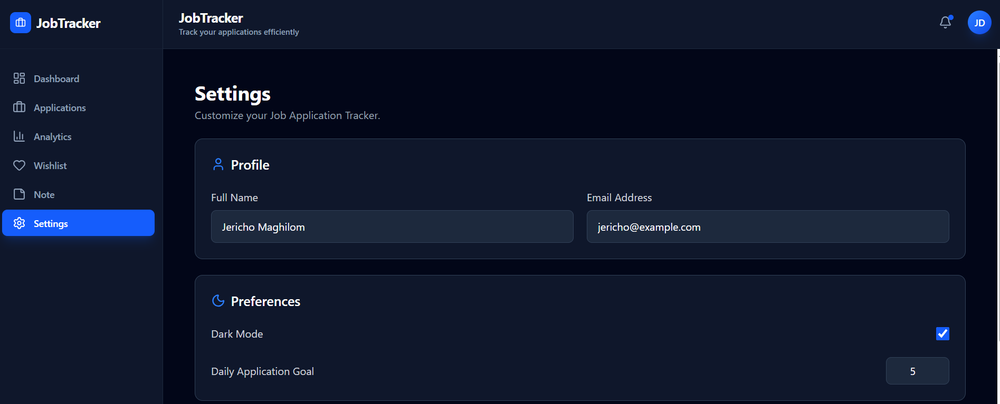

### Preferences

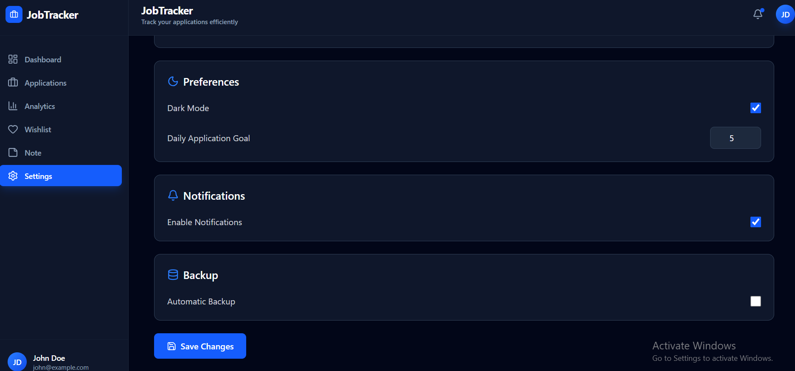

---


---

# 🚀 Getting Started

## Prerequisites

Before running the project, make sure you have installed:

- Node.js
- npm

Verify the installation:

```bash
node -v
npm -v
```

---

## Installation

Clone the repository

```bash
git clone https://github.com/YOUR_USERNAME/job-application-tracker.git
```

Navigate to the project directory

```bash
cd job-application-tracker
```

Install dependencies

```bash
npm install
```

Start the development server

```bash
npm run dev
```

Open your browser and visit

```
http://localhost:5173
```

---

# 📈 Current Modules

- Dashboard
- Applications
- Wishlist
- Notes
- Analytics
- Settings

---


---

# 🎨 UI Design

The application follows a modern **Dark Minimalist** design philosophy featuring:

- Dark Slate Color Palette
- Blue Accent Theme
- Rounded Cards
- Responsive Layout
- Clean Typography
- Dashboard-Style Components
- Modern Analytics Visualization

---

# 👨‍💻 Developer

**Jericho L. Maghilom**

Bachelor of Science in Information Technology  
Bestlink College of the Philippines

### Connect with me

- GitHub: https://github.com/bossecho


---

# ⭐ Support

If you found this project helpful, consider giving it a ⭐ on GitHub.

It helps others discover the project and motivates future improvements.

---

# 📄 License

This project is licensed under the MIT License.

Feel free to use, modify, and learn from this project for educational and portfolio purposes.
